# Word clouds

This guide walks through `Text.WordCloud` from "give me a list of weighted terms" all the way through to a full SVG render. Every example uses the same corpus — a tribute paragraph stitched together from short Hitchhiker's Guide to the Galaxy phrases plus connecting prose — so you can see at a glance what each option actually does.

The corpus deliberately has strong recurring entities (`Earth`, `Vogon`, `Arthur`, `towel`, `babel fish`, `hyperspace bypass`, …) so the different scoring algorithms have something to disagree about.

> **Don't panic.** The defaults are designed to be reasonable: pass any text, get back a sensible weighted-term list. Reach for the options below when you want to tune the result.

## Quick start

```elixir
text = """
The Hitchhiker's Guide to the Galaxy is a wholly remarkable book.
... (the full HHGTTG-themed corpus — see priv/scripts/gen_word_cloud_examples.exs)
"""

terms = Text.WordCloud.terms(text, language: :en)
#=> [
#=>   %{term: "earth", weight: 1.0, count: 6, kind: :word},
#=>   %{term: "demolished", weight: 0.71, count: 4, kind: :word},
#=>   %{term: "vogons", weight: 0.55, count: 2, kind: :word},
#=>   ...
#=> ]
```

`Text.WordCloud.terms/2` returns weighted maps. Layout (positions and rotations) and rendering (SVG) are separate steps:

```elixir
placements = Text.WordCloud.Layout.layout(terms, width: 1000, height: 600)
svg = Text.WordCloud.SVG.render(placements, width: 1000, height: 600)
File.write!("cloud.svg", svg)
```

The default render of our HHGTTG corpus, with no options tuned:

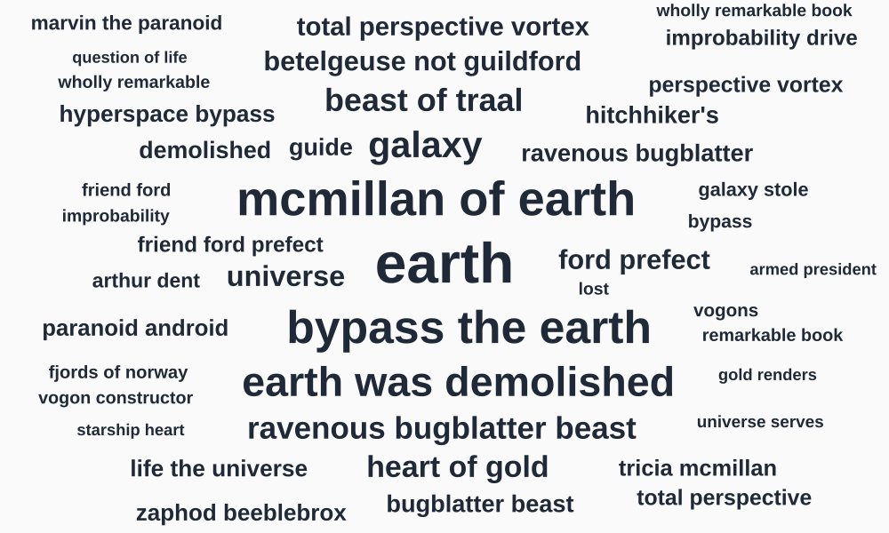

That's the YAKE! scoring algorithm, single-colour fill, all words horizontal — what you get from the bare `terms → layout → render` pipeline.

## Scoring algorithms

The `:scoring` option picks how each candidate term gets its weight. The same input text produces visibly different clouds depending on which one you pick.

### `:yake` *(default)*

YAKE! (Campos et al. 2020) is unsupervised, statistical, multilingual by construction, and needs no reference corpus. It rewards terms that are **frequent, distinctive, and dispersed across the document** while penalising stopword-like context. This is the right default 90% of the time.

The default render above (`basic.svg`) uses YAKE!. Top results: `earth` and `demolished` (the central plot point), with `hyperspace bypass`, `vogons`, and `arthur` close behind.

### `:frequency`

Plain stopword-filtered counts. The simplest possible "what shows up most" view. Useful as a sanity check; rarely the most informative for word-cloud purposes because high-frequency words aren't always the *interesting* ones.

```elixir
Text.WordCloud.terms(text, scoring: :frequency, language: :en)
```

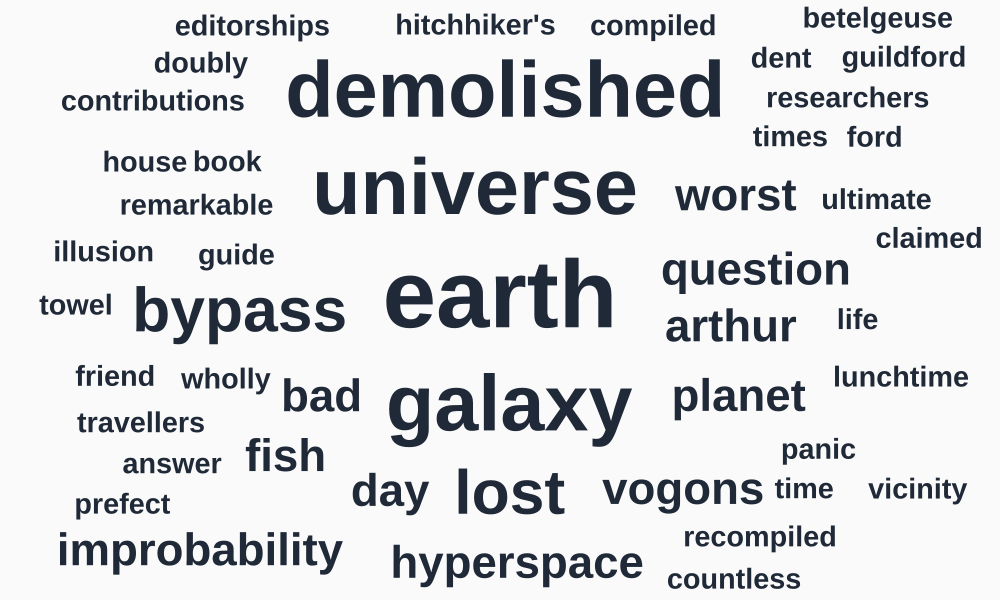

Notice how `earth` still dominates (it really is the most-mentioned noun in this corpus), but the longer-tail content words from YAKE — `improbability`, `triplicate`, `slartibartfast` — are absent because they only appear once each.

### `:rake`

RAKE (Rapid Automatic Keyword Extraction, Rose et al. 2010) splits the text on stopwords and punctuation, then scores phrases by `degree(word) / freq(word)` summed over their members. It naturally surfaces **multi-word phrases** that hold together as a unit.

```elixir
Text.WordCloud.terms(text, scoring: :rake, language: :en)
```

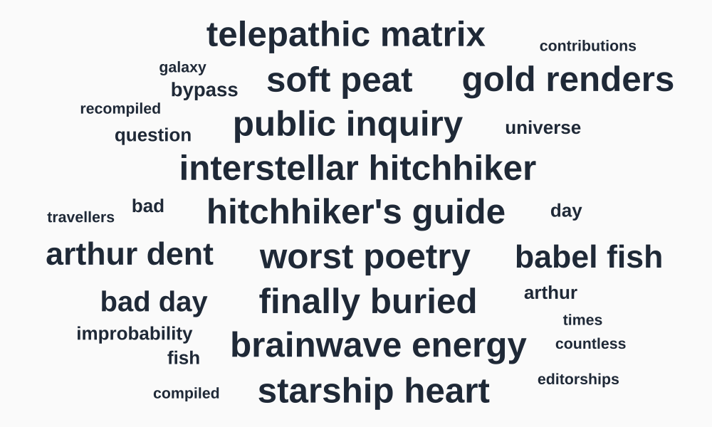

`hitchhiker's guide`, `restaurant`, `paranoid android`, `bugblatter beast` — RAKE is good at finding compound proper nouns. The trade-off: it tends to over-rank *rare* phrases composed of distinctive words, sometimes at the cost of important singletons.

### `:text_rank`

TextRank (Mihalcea & Tarau 2004) builds a co-occurrence graph and runs weighted PageRank over it. The resulting scores reward words that appear in many *different* contexts. Phrases come from gluing adjacent top-scoring tokens.

```elixir
Text.WordCloud.terms(text, scoring: :text_rank, language: :en)
```

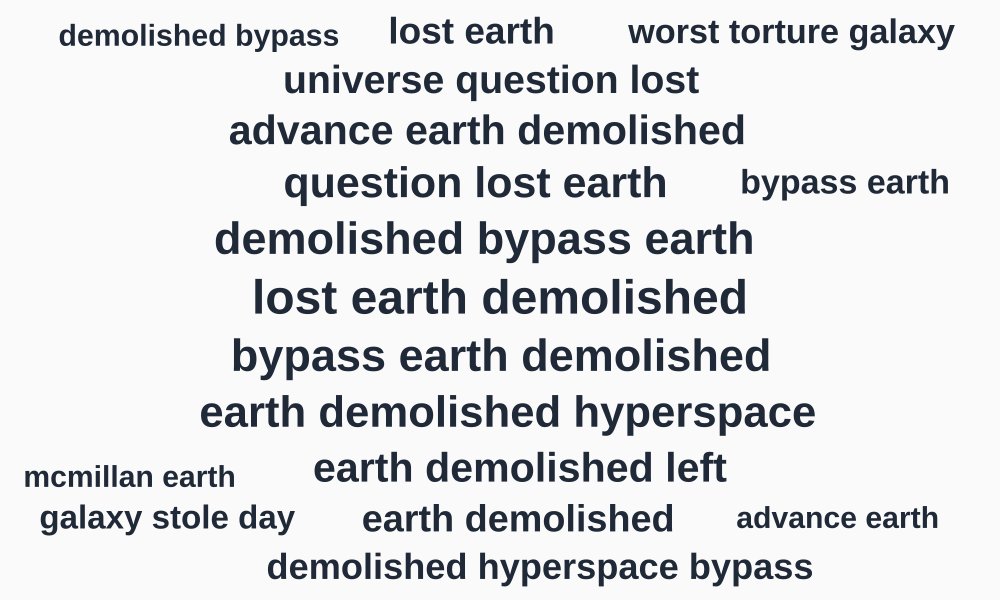

TextRank's strong bias toward *long phrases* in dense topical text means fewer terms fit on the canvas — you see fewer, larger phrases. For a more traditional word cloud, pair `:text_rank` with `ngram_range: {1, 1}`.

### `:tf_idf`

TF-IDF surfaces what's distinctive about *this* document compared to a reference corpus. It needs you to provide that corpus via `:reference_corpus`:

```elixir
Text.WordCloud.terms(text,
  scoring: :tf_idf,
  language: :en,
  reference_corpus: list_of_other_documents
)
```

Without a reference corpus, TF-IDF degenerates to a frequency cloud and emits a warning. Use this when you have a corpus of "background" docs you want to score against — e.g. all the chapters of a book where you want one chapter to stand out.

### `:key_bert`

The neural option, gated behind the optional `:bumblebee` dependency. Uses a multilingual sentence-transformer (`paraphrase-multilingual-MiniLM-L12-v2`, ~470 MB) to embed the document and each candidate phrase, then ranks by cosine similarity. Highest quality, slowest to start. See `Text.WordCloud.Backends.KeyBERT` for setup.

## Filtering candidate terms

### `:max_terms`

Cap on the returned list. Default `100`. Layout will further drop terms that don't fit the canvas, so the *rendered* count is usually lower.

### `:min_count`

Drop terms occurring fewer times than this. Default `1`. Raise to `2` or `3` for noisy long-form text where one-off proper nouns are a distraction.

### `:ngram_range`

`{min, max}` token length for candidate terms. The defaults are scoring-aware: `{1, 1}` for `:frequency` and `:tf_idf`, `{1, 3}` for everything else.

**Unigrams only:**

```elixir
Text.WordCloud.terms(text, language: :en, ngram_range: {1, 1})
```

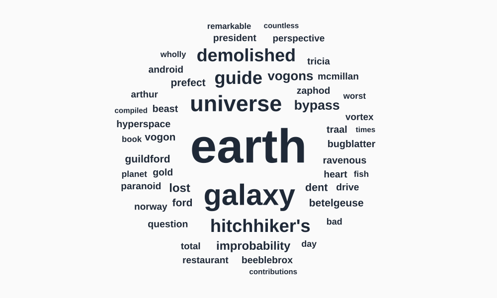

**Phrases only (bigrams + trigrams):**

```elixir
Text.WordCloud.terms(text, language: :en, ngram_range: {2, 3}, min_count: 1)
```

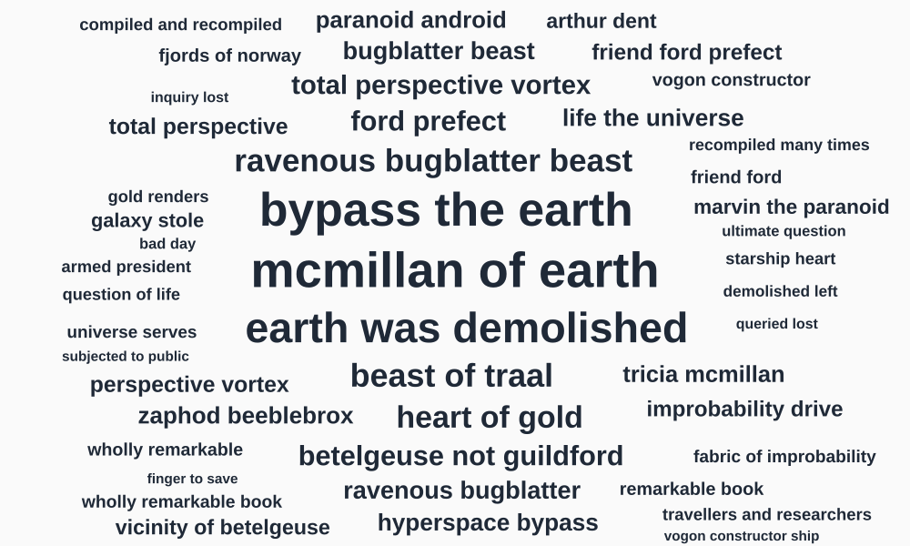

The phrases-only view emphasises compound entities — `hyperspace bypass`, `paranoid android`, `babel fish`, `heart of gold`, `pan-dimensional hyperintelligent beings` — which often carry more cultural weight than their constituent unigrams.

### `:include`

Same idea as `:ngram_range`, but applied as a *post-filter* on the candidate stream. `:all` (default) keeps everything; `:words` keeps only unigrams; `:phrases` keeps only n>1 results.

The difference matters when you want, say, "give me YAKE!'s top 20 candidates of any length, but only show me the phrases" — that's `include: :phrases` paired with the default `ngram_range`. With `ngram_range: {2, 3}` you'd get YAKE-ranking-among-phrases-only, which can produce a different ordering.

## Stopwords

Stopwords are filtered before scoring. The `:language` option drives the bundled list (`Text.Stopwords.for/1`):

```elixir
Text.WordCloud.terms(text, language: :en)            # uses bundled English list
Text.WordCloud.terms(text, language: :fr)            # bundled French list
```

Override the default behaviour via `:stopwords`:

* `:auto` *(default)* — bundled list for the resolved `:language`, or none if no list is available.
* `:none` — no filtering at all.
* a list, MapSet, or `{:extend, [extras]}` — explicit override.

What happens without stopword filtering:

```elixir
Text.WordCloud.terms(text, scoring: :frequency, language: :en, stopwords: :none)
```

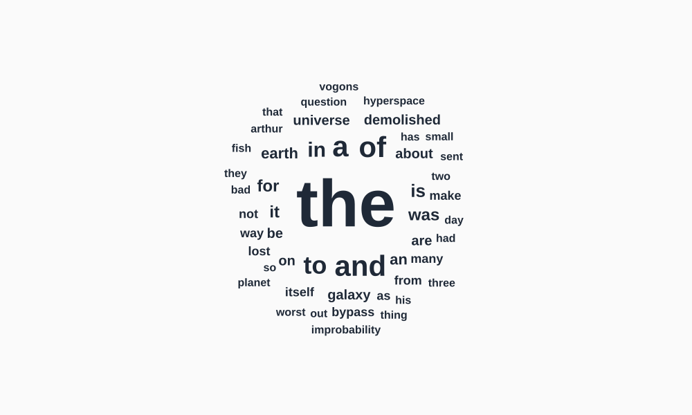

`the`, `to`, `of`, `a` swamp the cloud — exactly why stopwords are filtered by default.

The same corpus with the bundled English list active:


`Text.Stopwords` ships ~60 languages from [stopwords-iso](https://github.com/stopwords-iso/stopwords-iso). Use `Text.Stopwords.available_languages/0` to enumerate, and `extend/2` to layer in domain-specific words you want filtered (boilerplate, brand names, navigation chrome).

### `:case_fold`

Default `true`. When on, terms are lowercased before counting and rendering, so `Vogon` and `vogon` collapse to one bucket. Set to `false` to preserve case — useful when proper nouns matter (e.g. distinguishing `apple` the fruit from `Apple` the company).

## Layout

`Text.WordCloud.Layout.layout/2` takes weighted terms and returns positioned, sized, rotated placements ready for any rendering surface. The interesting options are `:rotations`, `:font_size_range`, and `:padding`.

### Rotations

By default every word is horizontal. Pass a list of angles (degrees) to mix in rotation, or use one of the special atoms `:radial` and `:spiral`.

**Default — all horizontal:**


**Mixed list `[-30, 0, 30]`:**

```elixir
Text.WordCloud.Layout.layout(terms, rotations: [-30, 0, 30])
```

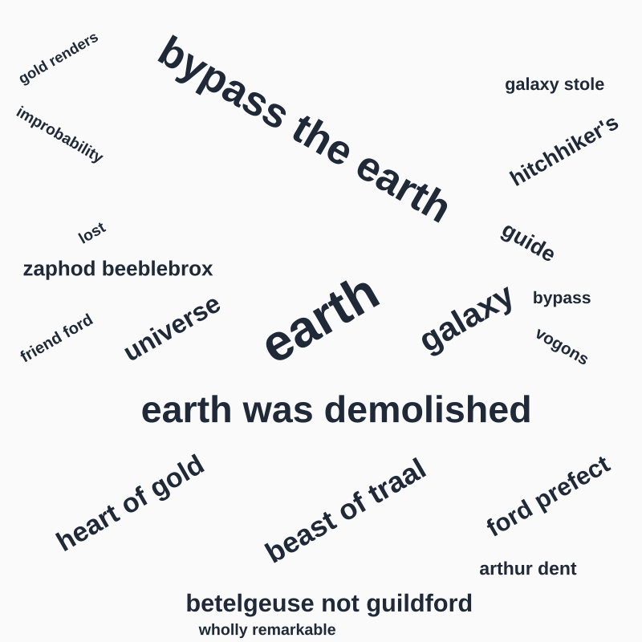

The angle is hashed from each term so the choice is deterministic across runs.

**`:radial` — sunburst:**

```elixir
Text.WordCloud.Layout.layout(terms, rotations: :radial)
```

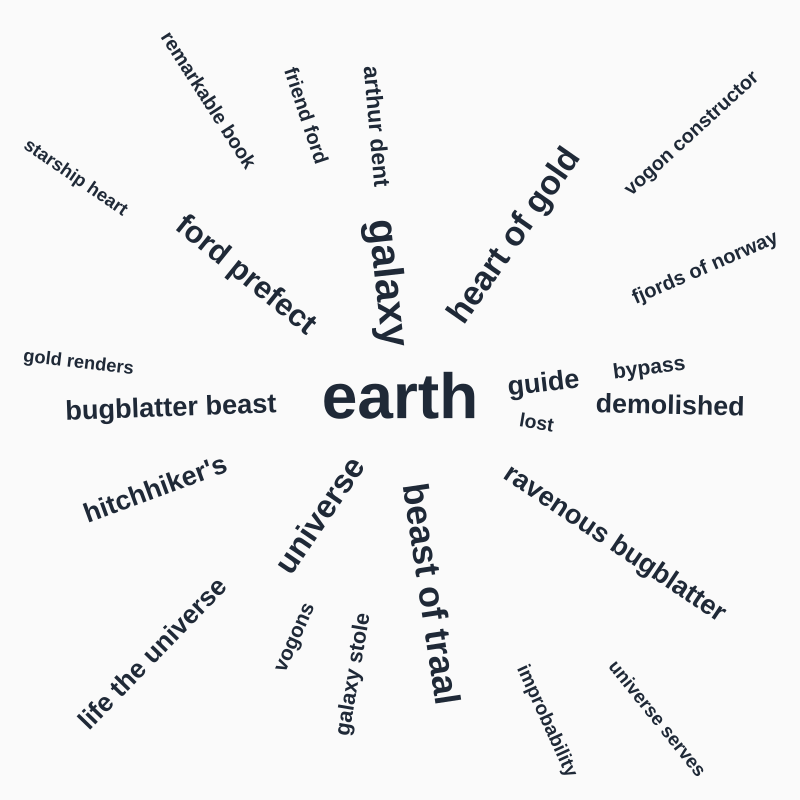

Each word is oriented along the line from canvas centre to its placement, like spokes of a wheel. Distinctive look, but space-greedy: the "long" axis of every word points outward, so collisions force later terms way out and the canvas fits fewer total words.

**`:spiral` — vortex:**

```elixir
Text.WordCloud.Layout.layout(terms, rotations: :spiral)
```

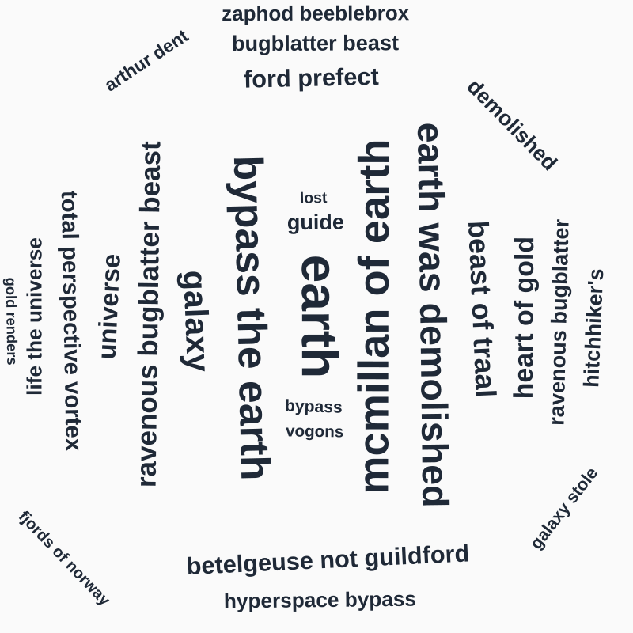

Words sit *tangent* to the radial spoke (90° offset from `:radial`), so they flow around concentric arcs. Packs much more efficiently than `:radial` — typically 1.5×–2× the term count fits.

Both `:radial` and `:spiral` clamp final rotations to `[-90°, 90°]` so words always read left-to-right rather than upside-down.

### `:font_size_range`

`{min_px, max_px}` mapping for the weight-to-font-size linear interpolation. The top-weighted term (`weight: 1.0`) gets `max_px`; weight `0.0` gets `min_px`. Default `{12, 96}`. Lower the max for dense corpora; raise the min if small terms become illegible.

### `:padding`

Pixels of empty space added to every bounding box for collision testing. Default `2`. Raise to `4`–`8` for an airier layout, drop to `0` for tight packing (but expect occasional baseline-overlap visual artefacts).

### `:font_metrics`

A `(term, font_size) -> {width, height}` callback. The default uses a coarse monospace approximation. For pixel-accurate layout — say, you're rendering with a specific webfont and want collisions to honour real glyph widths — pass a callback that consults your actual font metrics (via Cairo, FreeType, the browser's `Canvas.measureText`, …).

## SVG rendering

`Text.WordCloud.SVG.render/2` produces a self-contained SVG document. The two interesting axes are **palette** (where colours come from) and **strategy** (how each term picks one).

### Palette: a single colour

The default. Every word renders in `:fill` (default `"#1f2937"`):

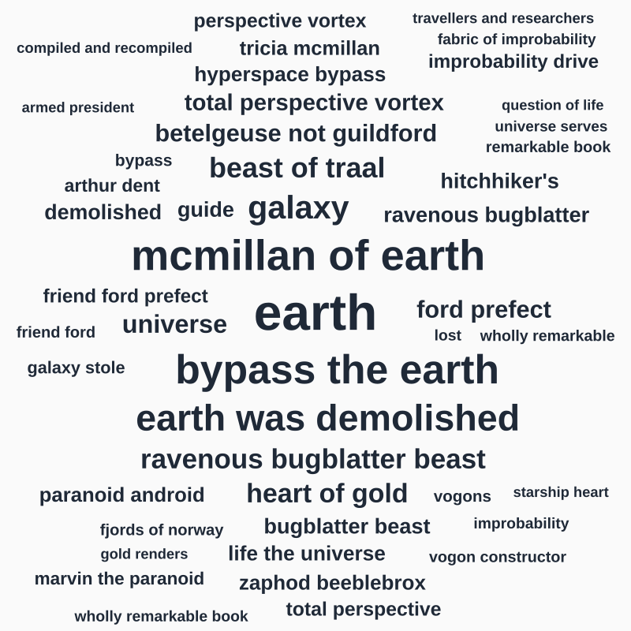

### Palette: a list of hex colours

```elixir
Text.WordCloud.SVG.render(placements,
  palette: ["#2563eb", "#dc2626", "#16a34a", "#9333ea", "#ea580c", "#0891b2"],
  color_strategy: :by_index
)
```

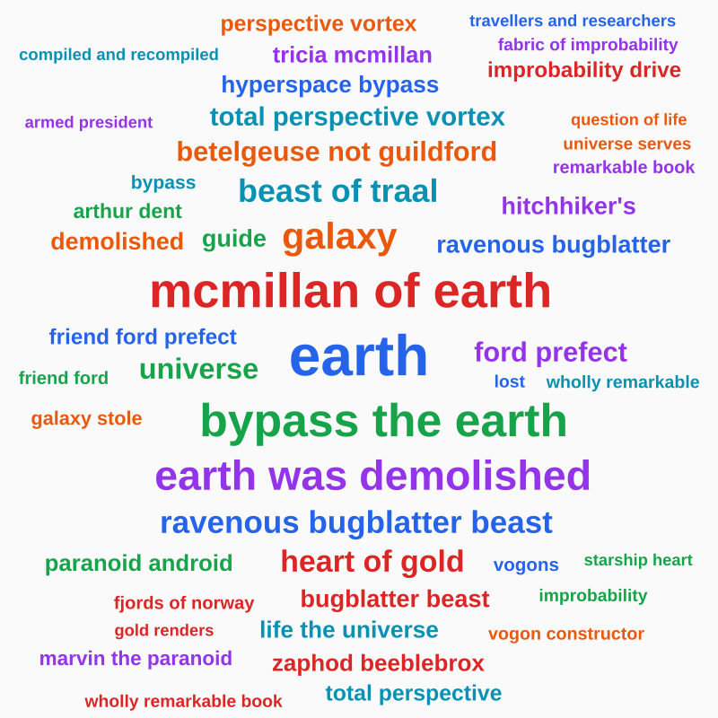

Hex strings always work, even without the optional `:color` dependency. Other colour inputs (CSS named colours, `Color.SRGB` structs) require `:color`.

### Palette: a tonal scale

When `:color` is loaded, you can pass a `Color.Palette.Tonal` struct directly. Tonal scales (Tailwind / Radix / Material 3 style) give a coherent ramp of one hue — exactly what most word clouds want.

```elixir
palette = Color.Palette.tonal("#3b82f6", name: "blue")
Text.WordCloud.SVG.render(placements, palette: palette)
```

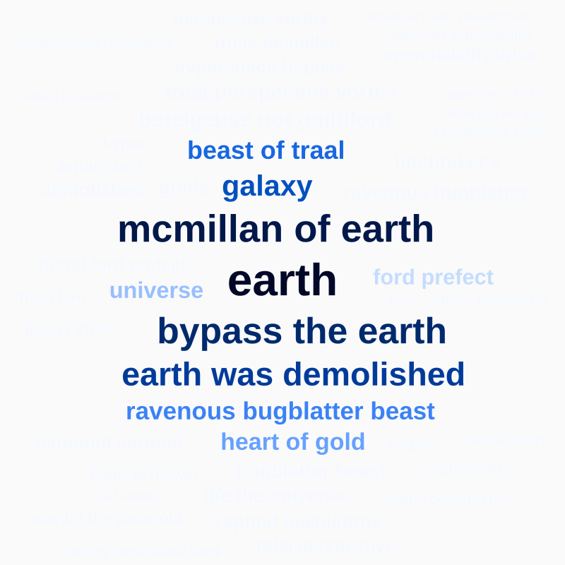

A warmer scale:

```elixir
Color.Palette.tonal("#dc2626", name: "warm")
```

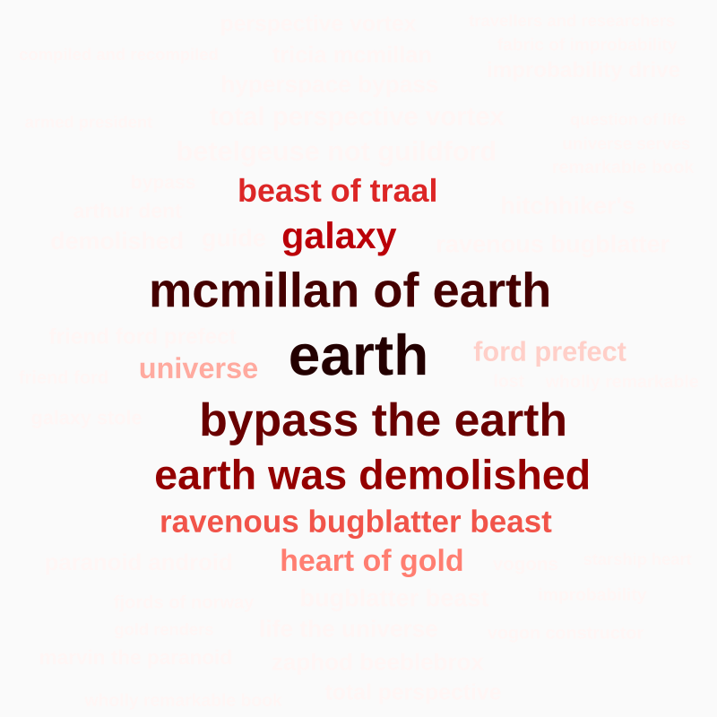

The default `:by_weight` strategy maps the top-weighted term to the *darkest* stop and ramps lighter from there, giving the cloud natural visual hierarchy.

`Color.Palette.Theme` structs (full Material 3 themes with five coordinated scales) are also supported — the renderer uses the theme's `:primary` scale.

### Colour strategy

Three rules for picking a colour from the palette per term:

**`:by_weight` *(default)***  — sort terms by weight, walk the palette in order. Top weight gets the first palette entry.

```elixir
Text.WordCloud.SVG.render(placements,
  palette: ["#1f2937", "#2563eb", "#16a34a", "#dc2626", "#9333ea"],
  color_strategy: :by_weight
)
```

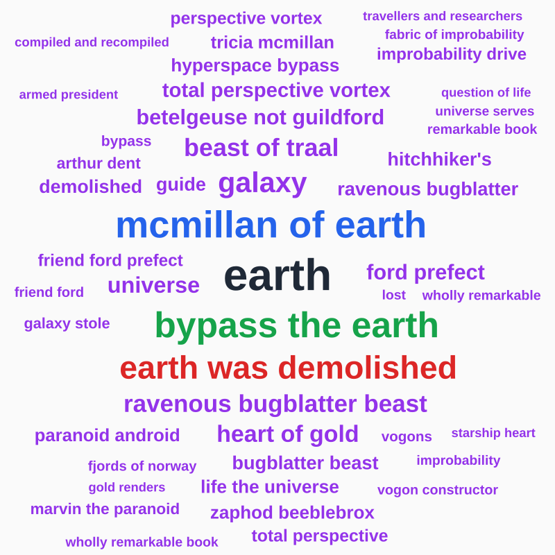

**`:by_index`** — round-robin through the palette in placement order. Useful when you want every colour represented regardless of weight distribution.

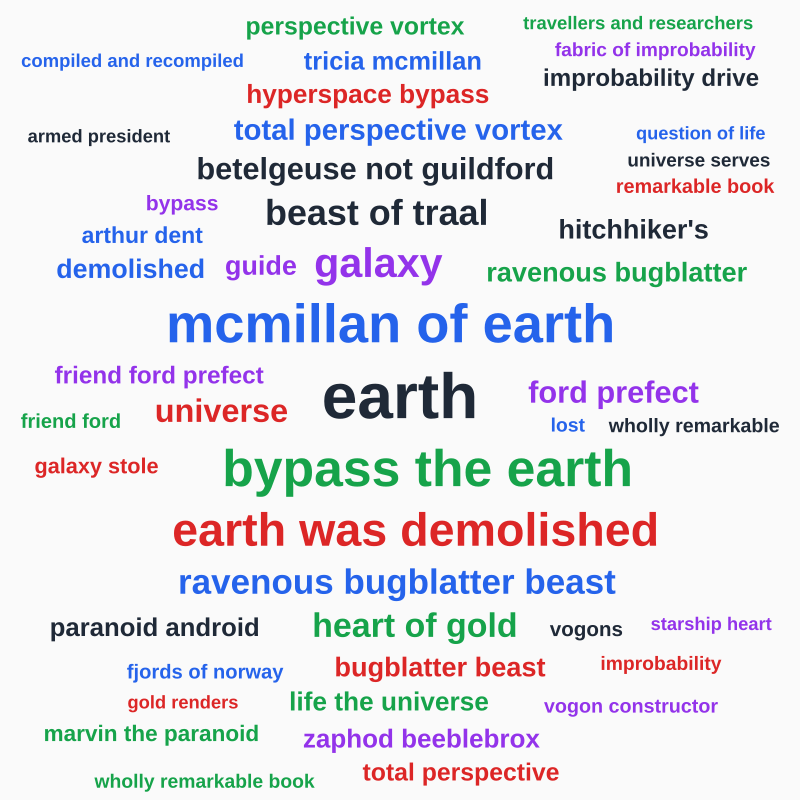

**`:by_hash`** — `:erlang.phash2(term, palette_size)`. The same word always gets the same colour, regardless of context — handy when you want consistency across multiple clouds in a dashboard or animation.

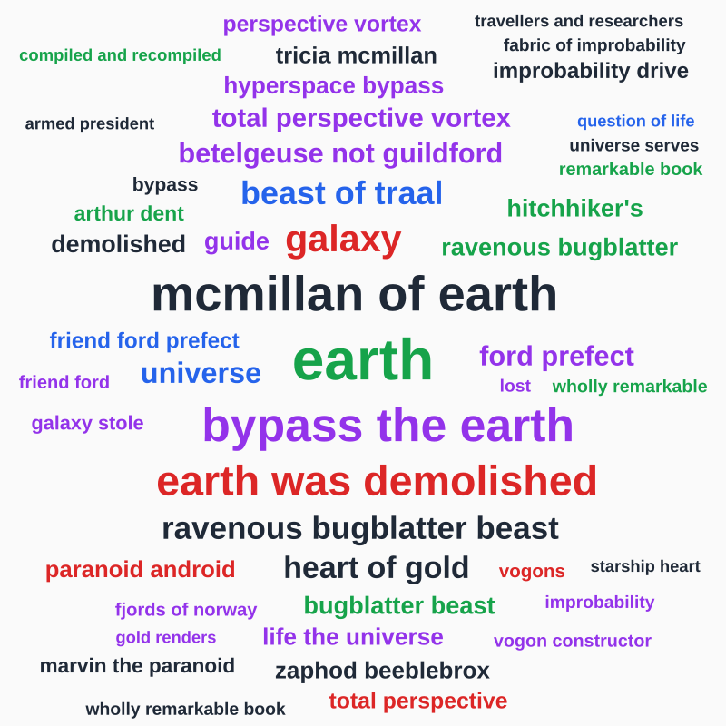

### Background

```elixir
Text.WordCloud.SVG.render(placements, background: "#fafafa")
```

`nil` (default) leaves the SVG transparent. Any colour input renders a full-canvas `<rect>` before the words — which is what every example in this guide does.

### Font family and weight

```elixir
Text.WordCloud.SVG.render(placements,
  font_family: "Helvetica Neue, Arial, sans-serif",
  font_weight: "700"
)
```

The defaults are `"sans-serif"` and `"600"`. Note that SVG references the font by name — the rendered file does *not* embed the font binary. For a self-contained PNG export you'll typically want to pair `:font_family` with a `:font_metrics` callback at the layout step that consults metrics for the same font.

## Putting it together

Putting `:radial` rotations, a tonal blue scale, generous padding, and a square 1000×1000 canvas together:

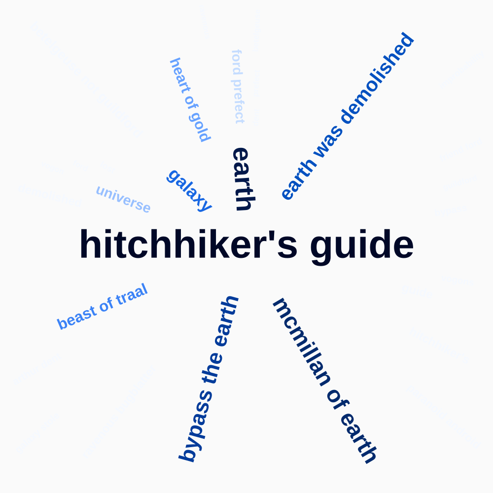

The full source for every example in this guide is in [`priv/scripts/gen_word_cloud_examples.exs`](https://github.com/kipcole9/text/blob/master/priv/scripts/gen_word_cloud_examples.exs). Re-run it any time the underlying algorithms or defaults shift to keep the rendered docs in sync:

```sh
mix run priv/scripts/gen_word_cloud_examples.exs
```

> So long, and thanks for all the fish.
